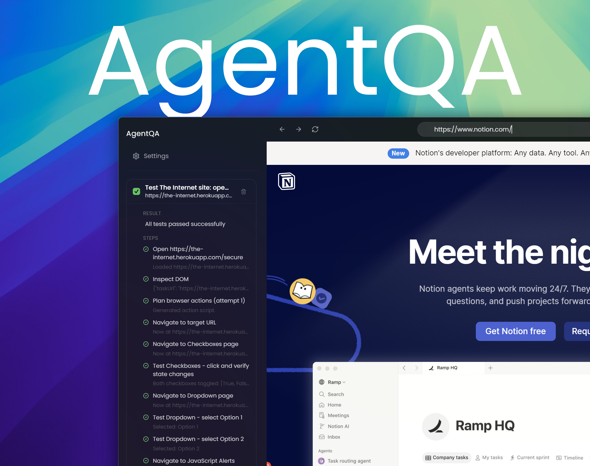
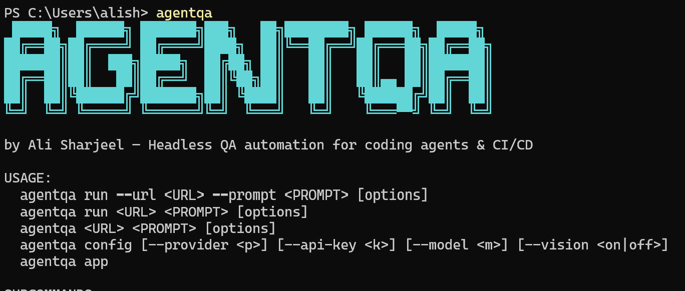
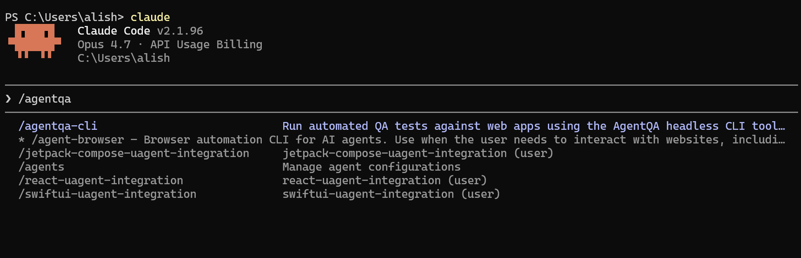

<p align="center">
  
</p>

<p align="center">
  AI-powered QA testing tool that explores websites, fills forms, clicks buttons, and finds bugs — automatically. Available as a headless CLI for coding agents.
</p>

<p align="center">
  
</p>

---


## Compatibility & Requirements

### Supported Operating Systems
- **Windows (10/11)**: CLI compatibility.
- **macOS (Apple Silicon & Intel)**: CLI compatibility.
- **Linux (Ubuntu, Debian, etc.)**: CLI compatibility (optimized for headless CI/CD).

### Supported Web Applications
AgentQA operates directly on the DOM, making it compatible with any website or single-page application (SPA), including:
- **Frontend Frameworks**: React, Vue, Angular, Svelte, SolidJS, Next.js, Nuxt, Astro, and vanilla HTML/JS.
- **Modern UI Elements**: Dynamic forms, multi-select dropdowns, modal windows, iframes, multi-page redirects, and asynchronous state updates.

---

## Quick Start

### Prerequisites

- **Node.js 20+** and **npm 10+**
- **browser-harness** — `uv tool install git+https://github.com/browser-use/browser-harness`
- An API key for **OpenAI** or **Anthropic**

---

### Installation & Setup

#### Option A: Desktop GUI App (Pre-built Installers)

If you prefer to run AgentQA using the React/Electron graphical desktop app with a live visual browser preview:

* Download the installer for your operating system from the [GitHub Releases Page](https://github.com/AliSharjeell/AgentQA/releases).
  * **Windows**: `AgentQA Setup 0.1.6.exe`
  * **macOS**: `AgentQA-0.1.6.dmg` (Apple Silicon & Intel)
  * **Linux**: `AgentQA-0.1.6.AppImage` (Ubuntu, Debian, etc.)

---

#### Option B: CLI Installation (NPM Global)

If you are using AgentQA for coding agents (e.g., Claude Code, Cline), CI/CD pipelines, or command-line testing:

```bash
# 1. Install globally from npm
npm install -g @alisharjeel/agentqa

# 2. Run the configuration wizard
agentqa config

# 3. Start testing immediately!
agentqa https://saucedemo.com "Login with standard_user/secret_sauce, add 2 items, checkout" --verbose
```

---

#### Option C: Running from Source (Development)

If you have cloned the repository and want to run or develop AgentQA locally:

```bash
# 1. Install dependencies
npm install

# 2. Start the Desktop GUI App in development mode
npm run dev

# 3. Or build the CLI entry point
npm run build:cli

# 4. Link the package globally to test CLI modifications
npm link
```

---

## CLI Usage

<p align="center">
  
</p>

```
agentqa <URL> <PROMPT> [options]
agentqa run <URL> <PROMPT> [options]
agentqa config [options]
```

### Subcommands

* **`run` (Default)**: Run QA tests. Can be omitted if positional URL and prompt are provided.
* **`config`**: Setup credentials interactively or via CLI flags (e.g. `agentqa config --api-key sk-xx --provider anthropic --vision off`).

### Options:
* `--url`: Target URL to test (can be a positional argument)
* `--prompt`: QA task description (can be a positional argument)
* `--provider`: API provider: `openai` | `anthropic`
* `--api-key`: API key override
* `--model`: LLM model name override
* `--mode`: Testing mode: `text` | `vision` (default: `text`)
* `--verbose`: Print step-by-step progress to stderr
* `--timeout`: Max seconds per step (default: `120`)
* `--json`: Output structured JSON directly to stdout

### Output Format

**stdout** — structured JSON for agent and CI parsing:

```json
{
  "ok": true,
  "summary": "Successfully logged in, added 2 items, completed checkout. No confirmed bugs found.",
  "steps": [
    { "instruction": "Open login page", "status": "done", "result": "Loaded https://saucedemo.com" },
    { "instruction": "Enter credentials", "status": "done", "result": "Filled username and password" },
    { "instruction": "Submit login", "status": "done", "result": "Now at /inventory.html" },
    { "instruction": "Add products to cart", "status": "done", "result": "Added 2 items" },
    { "instruction": "Complete checkout", "status": "done", "result": "Order confirmed" }
  ],
  "durationMs": 14200,
  "url": "https://saucedemo.com",
  "error": null
}
```

**Exit codes:** `0` = pass, `1` = fail.

### Agent Integration Example

```bash
# Setup API key
agentqa config --api-key sk-ant-xxx --provider anthropic

# Pipe result to jq in a script
result=$(agentqa https://staging.myapp.com "Test signup form")
echo $result | jq '.ok'

# Use in a CI script
if agentqa https://staging.myapp.com "Verify login and dashboard"; then
  echo "QA passed"
else
  echo "QA failed"
fi
```

---

## AI Agent Skill (for Antigravity, Claude Code, Codex, Cline, etc.)

<p align="center">
  
</p>

We provide a built-in skill so that AI coding assistants can learn how to use the `agentqa` CLI directly within your codebase. This allows agents to autonomously verify their own code changes!

### How Agents Use It
Because the skill is located in the `skills/agentqa-cli/` directory of the repository:
- **Antigravity / Codex**: Automatically discovers and loads the skill from the workspace root.
- **Claude Code**: Reads and adopts instructions from the local `skills/` directory and `AGENTS.md` automatically when running in this project.
- **Other Agents**: If using an extension (like Cline or Roo Code), you can import the custom skill instructions from `skills/agentqa-cli/SKILL.md`.

*(This teaches the agent how to run `agentqa` and how to interpret the JSON output).*

### Installing Globally in Claude Code

If you want the `agentqa-cli` skill to be available to Claude Code globally across all your projects, copy the skill folder to Claude's global skills directory:

* **Windows**:
  ```powershell
  xcopy /E /I skills\agentqa-cli %USERPROFILE%\.claude\skills\agentqa-cli
  ```
* **macOS / Linux**:
  ```bash
  cp -r skills/agentqa-cli ~/.claude/skills/agentqa-cli
  ```

### Fetching the Skill in Other Repositories

If you want to install or reference the AgentQA skill in another workspace, you can instruct your agent using local file paths or web URLs:

* **Via File URI (Antigravity/Codex)**:
  Provide the path using the `file://` scheme to point directly to the skill template:
  `file:///C:/Users/alish/.claude/skills/agentqa-cli/SKILL.md`
* **Via Web URL**:
  Ask the agent to download the raw skill from GitHub:
  > "Please download the AgentQA CLI skill configuration from \`https://raw.githubusercontent.com/AliSharjeell/AgentQA/master/skills/agentqa-cli/SKILL.md\` and save it locally in my project at \`skills/agentqa-cli/SKILL.md\`. After downloading, read the skill guidelines to understand how to verify my code changes using the global \`agentqa\` command."

---

## Project Structure

```
src/
├── core/                    # Shared engine (no Electron dependency)
│   ├── settings.ts          # Load/save settings.json
│   ├── api.ts               # OpenAI / Anthropic LLM callers
│   ├── prompt.ts            # LLM prompt template for browser automation
│   ├── harness.ts           # browser-harness spawner + set_value preamble
│   └── engine.ts            # Orchestrator: observe → LLM → act → retry
├── cli/                     # Headless CLI frontend
│   └── index.ts             # Arg parser, runner, JSON output
├── main/                    # Electron desktop app (main process)
│   ├── index.ts             # Window, BrowserView, IPC registration
│   └── db/
│       └── qaTaskRepo.ts    # Task + report JSON storage
├── preload/                 # Context bridge (renderer ↔ main)
│   └── index.ts
├── renderer/                # React frontend
│   ├── index.html
│   └── src/
│       ├── main.tsx         # React entry point
│       ├── App.tsx          # Sidebar nav + page router
│       ├── styles.css       # Tailwind + design system
│       └── pages/           # UI pages (Dashboard, Settings, etc.)
├── shared/                  # Types shared across all targets
│   └── types.ts
scripts/
└── build-cli.mjs            # esbuild bundler for CLI
```

---

## How It Works

1. **Observe** — Scrapes the page DOM for interactive elements (buttons, inputs, links) with coordinates
2. **Plan** — Sends the DOM observation + user prompt to an LLM (Claude/GPT) which generates a Python browser-harness script
3. **Act** — Pipes the script to `browser-harness` which controls Chrome via CDP (fills forms, clicks buttons, navigates)
4. **Retry** — If the script fails, retries up to 3 times with the error context
5. **Report** — Returns structured results with pass/fail, step details, and a summary

### Page Text Reading & Extraction

AgentQA has full page reading and visual understanding capabilities:
* **DOM Scraper (Text Mode)**: Automatically extracts and parses text contents, table headers, paragraph tags, placeholder text, values, and accessibility labels from the page. This is formatted into a clean text-based structural representation for the LLM.
* **Visual Verification (Vision Mode)**: When configured in vision mode (`--mode vision`), the tool takes screenshot captures of the browser viewport at each execution step. This allows the LLM to inspect visual layouts, read rendered/stylized text, check imagery, and detect visual regression/bugs.

### Human-Like Observable Typing

To make browser actions clear and observable in the live preview window:
* **Progressive Typing**: Input fields are populated character-by-character with a slight dynamic typing delay (defaults to 30ms per character). This avoids instantaneous text snaps and lets developers watch inputs as they happen.
* **Length-Based Scaling**: Typing speed dynamically scales for long inputs (e.g. descriptions, JSON text) to prevent blocking the test pipeline, capping the duration for any single text block at 1.5 seconds.

### Key Design Decisions

- **`set_value()` over `fill_input()`** — Uses JavaScript to set input values progressively (via prototype descriptor + event dispatch) instead of CDP key events, which avoids double-typing.
- **No browser bundled** — Uses `browser-harness` which manages its own Chrome daemon. No Playwright browser download required.
- **Shared engine** — `src/core/` has zero Electron imports.

---

## Tech Stack

| Layer | Technology |
|---|---|
| Desktop framework | Electron 34 |
| Build tool | electron-vite 3 + esbuild (CLI) |
| Frontend | React 18 + TypeScript |
| Styling | Tailwind CSS 3 |
| Icons | Lucide React |
| Browser automation | browser-harness (CDP) |
| AI | Anthropic Claude / OpenAI GPT |
| Language | TypeScript 5 (ES2022) |

---

## Available Scripts

```bash
npm run build:cli    # Bundle CLI to out/cli/index.js
npm run typecheck:cli  # TypeScript check (CLI only)
```

---

## Configuration

Settings are stored in `%APPDATA%/agentqa/settings.json`:

```json
{
  "apiProvider": "anthropic",
  "apiKey": "sk-ant-xxx",
  "apiBaseUrl": "",
  "model": "claude-sonnet-4-20250514"
}
```

The CLI also accepts settings via command-line flags and environment variables. You can create a `.env` file or export them directly in your shell:

```bash
QA_API_PROVIDER=anthropic
QA_API_KEY=sk-ant-xxx
QA_API_MODEL=claude-3-5-sonnet-20241022
QA_API_URL=https://api.anthropic.com
```

*Note: In Node.js 20+, you can load a `.env` file natively using `node --env-file=.env out/cli/index.js run ...`*

---

## QA Agent Rules

The AI agent follows these rules when testing:

- Never report a bug unless verified twice after waiting, scrolling, and checking the correct page
- If no bugs are found, say **"No confirmed bugs found"** — never invent issues
- If navigation fails or URL becomes `chrome-error://chromewebdata`, mark as **infrastructure failure**, not a website bug
- Use `set_value()` for all form inputs (React/Vue compatible)
- Wrap all scripts in try/except with structured error output


## Troubleshooting

### "Browser-harness could not be started"

Install it: `uv tool install git+https://github.com/browser-use/browser-harness`

### Double-typing in form fields

This was fixed by using `set_value()` (JavaScript-based) instead of `fill_input()` (CDP key events). If you see it, make sure you're on the latest build.

### CLI returns "No API key found"

Pass `--api-key` or set `$QA_API_KEY`.

---

## License

MIT